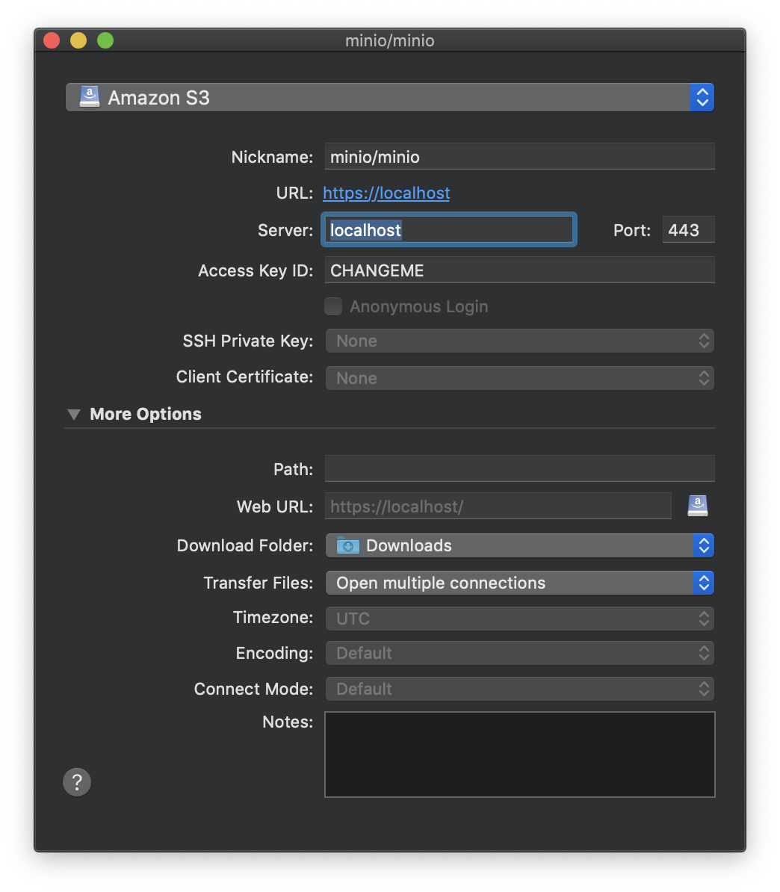
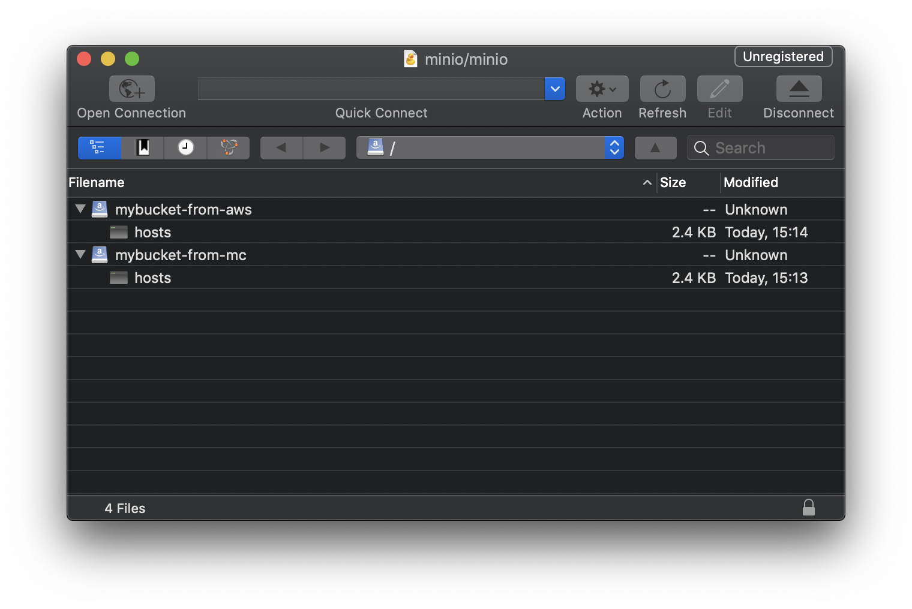

# Simple S3

Simple docker service based on Minio server that is an Amazon S3 (Simple Storage Service) compatible object storage server.

# Pre requirements

* Git
* Docker
* Make
* Python

# Clone

    git clone https://github.com/humbertodias/docker-minio-s3.git
    cd docker-minio-s3

# Server

    make generate_keys
    make up

If you want to change the keys ACCESS/SECRET, fill that before make up

    ACCESS_KEY=CHANGEME
    SECRET_KEY=CHANGEME

# Client

## Minio

Install

    brew install minio/stable/mc

Configure

    ACCESS_KEY=CHANGEME
    SECRET_KEY=CHANGEME
    mc config host add s3 https://localhost $ACCESS_KEY $SECRET_KEY --api S3v4

Create a Bucket

    mc mb s3/mybucket-from-mc --insecure

Copy

    mc cp /etc/hosts s3/mybucket-from-mc --insecure

List

    mc ls s3 --insecure

Remove

    mc rm --force --insecure s3/mybucket-from-mc/hosts
    mc rm --force --insecure s3/mybucket-from-mc/

## Amazon

Install

    pip install awscli

Environment

    export AWS_ACCESS_KEY_ID=CHANGEME
    export AWS_SECRET_ACCESS_KEY=CHANGEME

Create a bucket
    
    aws --endpoint-url https://localhost s3 mb s3://mybucket-from-aws --no-verify-ssl

Copy file to bucket
    
    aws --endpoint-url https://localhost s3 cp /etc/hosts s3://mybucket-from-aws --no-verify-ssl

List

    aws --endpoint-url https://localhost s3 ls --no-verify-ssl

Remove

    aws --endpoint-url https://localhost s3 rm --recursive s3://mybucket-from-aws/ --no-verify-ssl

CyberDuck (S3 Client)

Connection 

List

# References

* [Minio Server](https://hub.docker.com/r/minio/minio/)

* [Minio Client](https://docs.minio.io/docs/minio-client-quickstart-guide)

* [S3 CLI](https://aws.amazon.com/cli/)

* [S3 GUI](https://cyberduck.io)